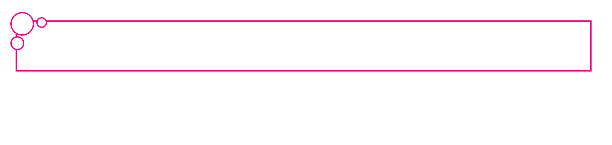

# Lab 2: Flow layout and Positioned layout in CSS.
* Create a wrapper element as shown in the figure below to fill the empty space in smaller viewports. It specifies a maximum width and will horizontally center itself within the parent if space is available. It includes some horizontal "breathing room" so that its children aren't pressed up against the viewport's edges.

> hint: `max-width`

* Design a circuit as shown in the figure.

* Design a decorative item as shown in the screenshot below.

